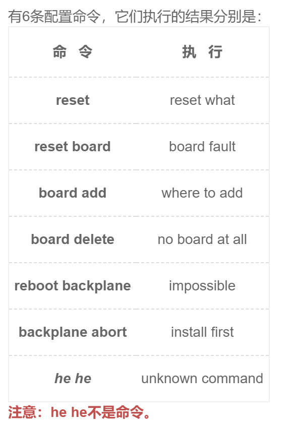

## 描述



为了简化输入，方便用户，以“最短唯一匹配原则”匹配（注：需从首字母开始进行匹配）：

1、若只输入一字串，则只匹配一个关键字的命令行。例如输入：r，根据该规则，匹配命令reset，执行结果为：reset what；输入：res，根据该规则，匹配命令reset，执行结果为：reset what；

2、若只输入一字串，但匹配命令有两个关键字，则匹配失败。例如输入：reb，可以找到命令reboot backpalne，但是该命令有两个关键词，所有匹配失败，执行结果为：unknown command

3、若输入两字串，则先匹配第一关键字，如果有匹配，继续匹配第二关键字，如果仍不唯一，匹配失败。

- 例如输入：r b，找到匹配命令reset board 和 reboot backplane，执行结果为：unknown command。
- 例如输入：b a，无法确定是命令**board add**还是**backplane abort**，匹配失败。

4、若输入两字串，则先匹配第一关键字，如果有匹配，继续匹配第二关键字，如果唯一，匹配成功。例如输入：bo a，确定是命令**board add**，匹配成功。

5、若输入两字串，第一关键字匹配成功，则匹配第二关键字，若无匹配，失败。例如输入：b addr，无法匹配到相应的命令，所以执行结果为：unknow command。

6、若匹配失败，打印“unknown command”

- 注意：有多组输入。
- 数据范围：数据组数：$1≤t≤800$ ，字符串长度 $1≤s≤20$ 
- 进阶：时间复杂度：$O(n)$ ，空间复杂度：$O(n)$ 

### 输入描述：

多行字符串，每行字符串一条命令

### 输出描述：

执行结果，每条命令输出一行

## 示例1
```0
输入：
reset
reset board
board add
board delet
reboot backplane
backplane abort
输出：
reset what
board fault
where to add
no board at all
impossible
install first
```
## 高手代码
```python
'''
自己写的用正则匹配太low了，看了@中年美少女写的切片思想佩服了，另外不用字典免去了双层循环的做法，偷来粘在这里供大家欣赏。
'''
while True:
    try:
        m=input().strip().split()
        key=["reset","reset board","board add","board delete","reboot backplane","backplane abort"]
        value=["reset what","board fault","where to add","no board at all","impossible","install first"]
        #不建字典，用列表的方式避免了双层循环，如果实在要用列表，直接用dict(zip（list1,list2）)合成字典都行.
        if len(m)<1 or len(m)>2:   #判断当输入为小于1个或者输入大于2个字符串时，不符合命令，就报未知命令
            print("unknown command")
        elif len(m)==1:   #当输入一个字符串
            if m[0]==key[0][:len(m[0])]:  #这里才是解决这个题的最佳思想，利用切片的思想来匹配
                print(value[0])
            else:
                print("unknown command")
        else:
            index=[]
            for i in range(1,len(key)): #这里把所有原始命令遍历，如果这里写成(len(key)+1),也就是1..6，那么下面的key[i]要改成k[i-1]才符合逻辑
                a=key[i].split() #将具体的一个KEY分割成两部分
                if m[0]==a[0][:len(m[0])] and m[1]==a[1][:len(m[1])]:  #然后去匹配被分割的key,这里不可能有reset这种单独的，因为上面条件已经限制了。
                    index.append(i)  #符合条件就把这个位置入列表
            if len(index)!=1:
                print("unknown command")
            else:
                print(value[index[0]]) #输出对应的value值
    except:
        break
```